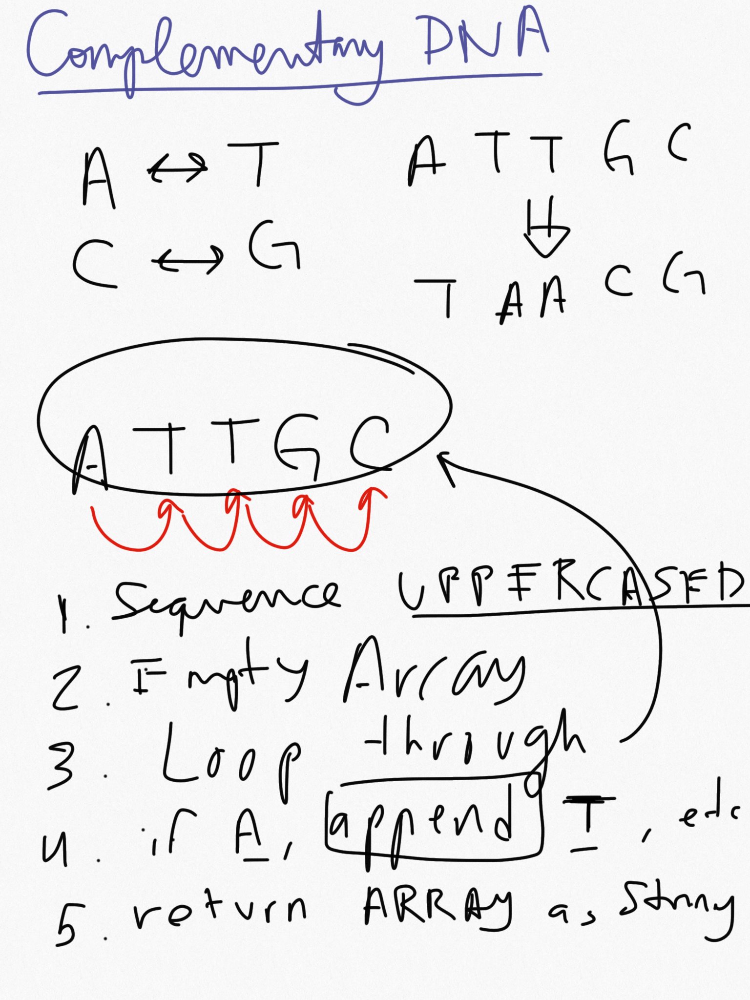

# Complemetary DNA

DNA is a chemical found in the nuclues of cells and carries the "instructions" for the development and functioning of living organisms. In DNA strings, symbols "A" and "T" are complements of each other, as "C" and "G". You have a function with one side of the DNA (string); you need to get the other complementary side. DNA strand is never empty or there is no DNA at all. 

```python
DNA_strand("ATTGC") # return "TAACG"
DNA_stand("GTAT") # return "CATA"
```

## Though process



## Script

[complementary_dna.py](https://github.com/nestorivanmo/Codewars/blob/master/Python/Fundamentals/Scripts/ComplementaryDNA/complementary_dna.py)